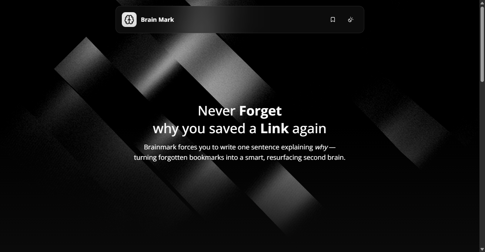
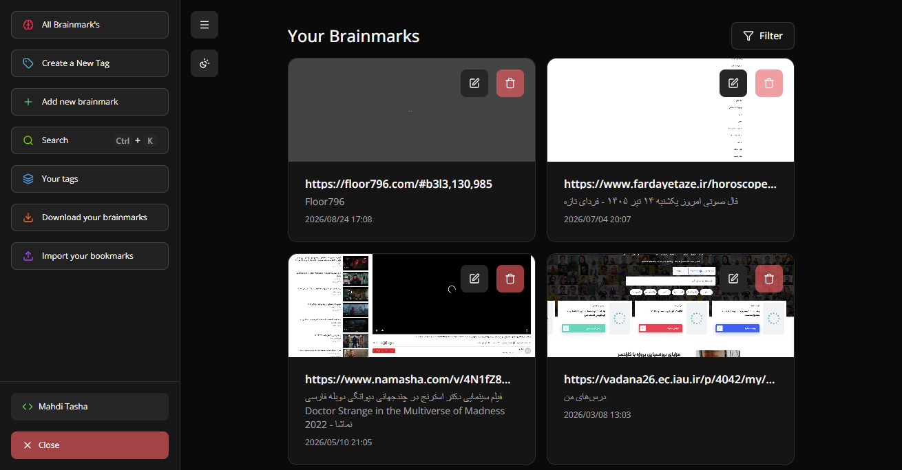
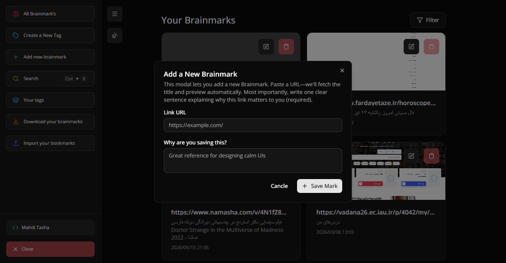
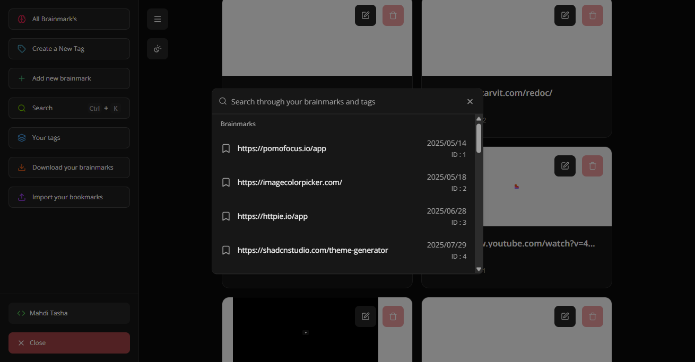

# Brainmark 🧠🔖

### Save the link. Capture the reason. Remember why it mattered.

Brainmark is a **local-first bookmark manager built around one simple rule: every saved link needs a reason**.

Instead of collecting hundreds of links that eventually become meaningless, Brainmark preserves the context behind each bookmark — turning passive saving into intentional knowledge capture.

> **Don't just save what you found. Save why you found it valuable.**

---

## ✨ Why Brainmark?

Traditional bookmark managers optimize for **saving more**.

Brainmark optimizes for **remembering better**.

A URL by itself is easy to forget. The reason you saved it gives that URL context, meaning, and future value.

Brainmark therefore makes the **"why" part of the bookmark itself**.

### The idea

```text
Discover something valuable
          ↓
      Save the URL
          ↓
   Explain why it matters
          ↓
      Add a tag
          ↓
   Build your knowledge
       network over time
```

This creates a lightweight workflow for collecting resources intentionally instead of building another bookmark graveyard.

---

## 🚀 Features

### 🔖 Intentional Bookmarks

Every bookmark contains:

- URL
- A required **"why"** explanation
- Optional tag
- Creation timestamp
- Unique identifier

The required reason preserves the context that normally disappears after saving a link.

### 🏷️ Tagging

Organize bookmarks with tags and keep related resources grouped together.

### 🔎 Search & Filtering

Quickly narrow down your saved knowledge and switch between different bookmark views.

### ✏️ Bookmark Management

Bookmarks can be:

- Created
- Edited
- Archived
- Deleted

### 💾 Local-first Storage

Brainmark stores bookmark state locally in the browser rather than requiring a remote database for its core workflow.

This keeps the experience lightweight and avoids unnecessary account or backend complexity.

### 🌙 Focused UI

The interface is intentionally minimal:

- Dark mode
- Responsive layouts
- Keyboard-friendly interactions
- Contextual menus
- Toast feedback
- Focused information hierarchy

---

## 🖥️ Screenshots

### Landing Page



### Bookmark Dashboard



### Create Bookmark



### Bookmark Management



---

## 🌐 Live Demo

**[Open Brainmark →](https://brainmark.vercel.app/)**

The live application demonstrates the complete bookmark workflow directly in the browser.

---

## 🏗️ Architecture

Brainmark follows a lightweight client-side architecture designed around a simple principle: **the bookmark workflow should not need a backend to be useful.**

```text
                    ┌─────────────────────┐
                    │     Next.js App     │
                    │    App Router       │
                    └──────────┬──────────┘
                               │
              ┌────────────────┼────────────────┐
              │                │                │
              ▼                ▼                ▼
        Landing Page      Dashboard        UI System
              │                │                │
              │                ▼                │
              │        Bookmark State          │
              │                │                │
              │                ▼                │
              │       Browser Local Storage    │
              │                                │
              └───────────────┬────────────────┘
                              ▼
                     Persistent Bookmarks
```

### Core data model

```ts
interface BookMarkType {
  url: string;
  why: string;
  tag?: TagsType;
  createdAt: string;
  id: number;
}
```

This keeps the bookmark model intentionally small while preserving the information that makes a saved resource useful later.

---

## 🧠 Key Technical Decisions

### 1. Local state instead of a backend

Brainmark's core value proposition doesn't require accounts, servers, or a database.

Using browser-side persistence makes the application:

- Simple to deploy
- Fast to use
- Lightweight
- Independent from a backend
- Suitable for a personal knowledge workflow

The bookmark dashboard reads and persists bookmark data through `use-local-storage-state`.

### 2. Next.js App Router

Next.js provides the application structure, routing, layouts, and production build pipeline while keeping the project easy to deploy.

### 3. TypeScript-first data modeling

Bookmark and tag structures are explicitly typed, making the data flow predictable and reducing accidental inconsistencies as the application grows.

### 4. Schema-based form validation

React Hook Form and Zod are used together to keep user input structured and validated.

This is especially important for Brainmark because the **"why" field is part of the product's core rule**, not an optional piece of metadata.

### 5. Component-driven UI

The interface is built from reusable UI primitives and focused feature components, allowing interactions such as menus, dialogs, forms, tooltips, and notifications to remain consistent across the application.

---

## 🧩 Challenges & Solutions

### Challenge 1 — Making bookmarks meaningful

**Problem:**
A saved URL contains almost no context about why it was valuable.

**Solution:**
Brainmark makes the reason mandatory. Every bookmark carries the user's original intention alongside the URL.

---

### Challenge 2 — Keeping the application lightweight

**Problem:**
A personal bookmark system can easily become another account-based SaaS application with authentication, APIs, databases, and synchronization.

**Solution:**
The core workflow is completely client-side, using browser persistence instead of introducing backend infrastructure that the product doesn't fundamentally need.

---

### Challenge 3 — Building a useful dashboard without information overload

**Problem:**
Bookmark collections become difficult to scan as they grow.

**Solution:**
The dashboard focuses on the bookmark itself and provides lightweight organization and filtering instead of introducing a complex knowledge-management interface.

---

### Challenge 4 — Balancing experimentation with maintainable UI

**Problem:**
Brainmark includes a visually distinctive landing experience while the application itself needs to remain focused and practical.

**Solution:**
The project separates the marketing experience from the dashboard workflow and uses reusable UI primitives for application interactions.

---

## 🛠️ Tech Stack

| Technology                  | Purpose                          |
| --------------------------- | -------------------------------- |
| **Next.js 16**              | Application framework & routing  |
| **React 19**                | UI architecture                  |
| **TypeScript**              | Type safety                      |
| **Tailwind CSS 4**          | Styling & responsive design      |
| **Radix UI**                | Accessible UI primitives         |
| **React Hook Form**         | Form state management            |
| **Zod**                     | Schema validation                |
| **use-local-storage-state** | Persistent browser state         |
| **Framer Motion**           | UI animations                    |
| **React Three Fiber**       | Interactive 3D/visual experience |
| **Three.js**                | 3D rendering                     |
| **Lucide React**            | Interface icons                  |
| **next-themes**             | Theme management                 |
| **Sonner**                  | User feedback & notifications    |

---

## 📁 Project Structure

```text
brainmark/
├── app/
│   ├── dashboard/
│   │   └── page.tsx
│   ├── globals.css
│   ├── layout.tsx
│   └── page.tsx
│
├── component/
│   ├── layout/
│   ├── section/
│   │   └── home/
│   ├── ui/
│   ├── brainmark.tsx
│   ├── beamBg.tsx
│   └── ...
│
├── hook/
├── lib/
├── type/
├── public/
│
├── next.config.ts
├── package.json
└── tsconfig.json
```

The project separates application routes, reusable UI, feature components, hooks, utilities, and domain types to keep the codebase easy to extend.

---

## ⚡ Getting Started

### Prerequisites

- Node.js 20+
- npm, pnpm, yarn, or Bun

### Installation

```bash
git clone https://github.com/tasha-dev/brainmark.git
cd brainmark
npm install
```

### Development

```bash
npm run dev
```

Open:

```text
http://localhost:3000
```

### Production build

```bash
npm run build
npm run start
```

### Lint

```bash
npm run lint
```

No external database or API credentials are required for the core bookmark workflow.

---

## 🔐 Data Model

Brainmark intentionally keeps its core data model small.

### Bookmark

```text
Bookmark
├── id
├── url
├── why
├── tag
└── createdAt
```

### Tag

```text
Tag
├── id
├── label
├── color
└── createdAt
```

This structure keeps bookmarks portable while leaving room for future capabilities such as synchronization, richer resurfacing algorithms, analytics, or cross-device storage.

---

## 🎯 Product Philosophy

Brainmark is built around a simple idea:

> **The value of a saved resource isn't just the resource itself — it's the context that made you save it.**

Instead of maximizing the number of links you collect, Brainmark encourages you to build a smaller, more intentional knowledge network.

**Save intentionally. Remember context. Build your second brain.**

---

## 🧪 Project Status

Brainmark is a personal experimental project focused on exploring:

- Intentional knowledge capture
- Local-first application design
- Client-side persistence
- Bookmark organization
- Focused product UX
- Modern React / Next.js architecture

The current implementation is intentionally lightweight and can evolve toward synchronization, richer resurfacing logic, and more advanced knowledge-management features.

---

## 🤝 Contributing

Brainmark is currently a personal project, but feedback, ideas, and contributions are welcome.

You can:

- Open an issue
- Suggest an improvement
- Discuss architecture
- Submit a pull request

---

## 📄 License

MIT License — use it, learn from it, and build something better.

---

## 🔗 Links

- **Live Demo:** https://brainmark.vercel.app/
- **Repository:** https://github.com/tasha-dev/brainmark

---

<div align="center">

**Brainmark 🧠🔖**

_Save the link. Capture the reason. Remember why it mattered._

</div>
